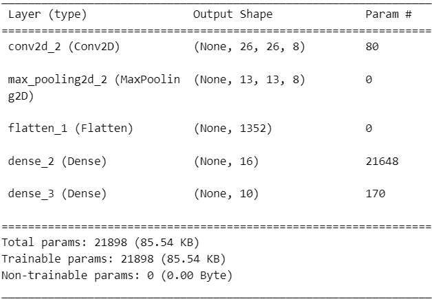
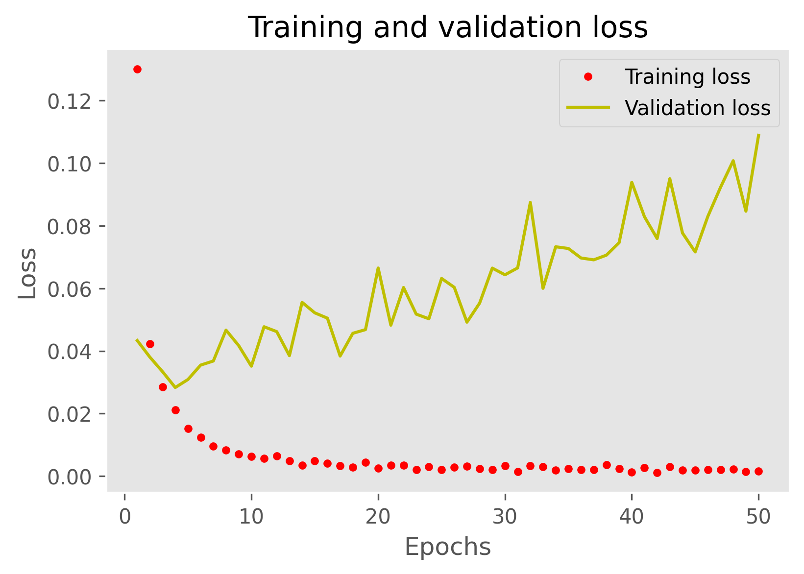
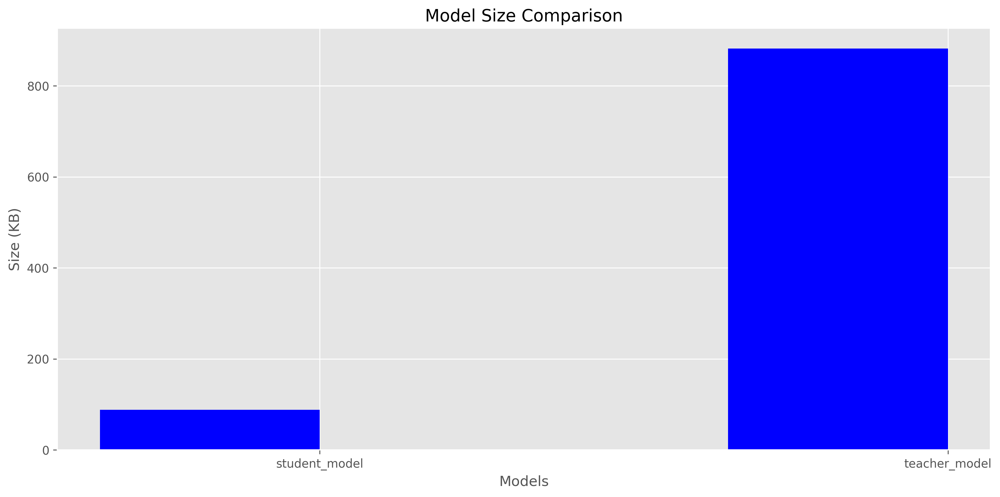
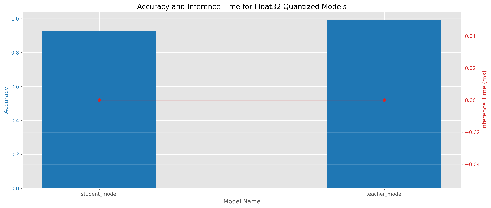
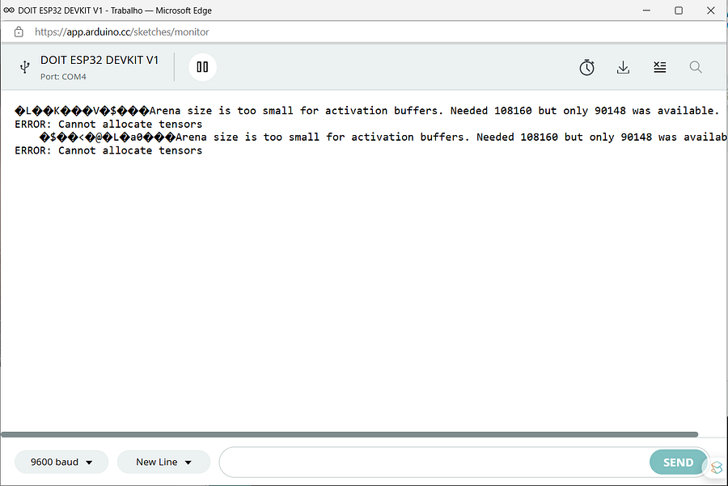
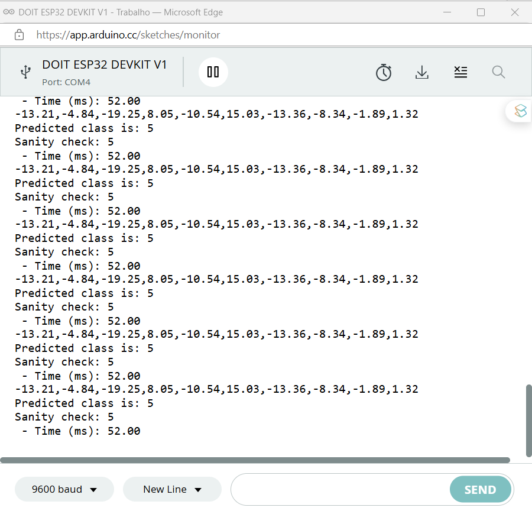

# TinyML - Knowledge Distillation

*From mathematical foundations to edge implementation*

**Social media:**


👨🏽‍💻 Github: [thommaskevin/TinyML](https://github.com/thommaskevin/TinyML)

👷🏾 Linkedin: [Thommas Kevin](https://www.linkedin.com/in/thommas-kevin-ab9810166/)

📽 Youtube: [Thommas Kevin](https://www.youtube.com/channel/UC7uazGXaMIE6MNkHg4ll9oA)

:pencil2:CV Lattes CNPq: [Thommas Kevin Sales Flores](http://lattes.cnpq.br/0630479458408181)

👨🏻‍🏫 Research group: [Conecta.ai](https://conect2ai.dca.ufrn.br/)


## SUMMARY

1 - Introduction

 1.1 - The Teacher-Student Paradigm

 1.2 - Soft Labels and Relative Class Relationships 

 1.3 -Temperature Parameter

2 - Mathematical Formulation

 2.1 - Cross-Entropy Loss

 2.2 - Kullback-Leibler Divergence

 2.3 - Temperature Scaling 

 2.4 -Training Process


3 - TinyML Implementation


---

## 1 - Introduction

Knowledge Distillation (KD) is a technique that facilitates the transfer of knowledge from a large, complex model - or a collection of models - into a single, more compact model that is suitable for deployment in real-world scenarios. This process is particularly relevant for neural network models characterized by intricate architectures with multiple layers and numerous parameters.


With the rise of deep learning over the past decade, which has demonstrated remarkable success across various domains such as speech recognition, image recognition, and natural language processing, knowledge distillation has become increasingly important for practical applications.


One of the significant challenges in deploying large deep neural networks is their high demand for memory and computational resources, especially in edge devices that have limited capacity. To address this issue, a model compression technique was introduced, which enables the transfer of knowledge from a larger model to a smaller one without incurring substantial losses in performance. This innovative approach was formally defined as the "Knowledge Distillation" framework by Geoffrey Hinton and his colleagues.
As illustrated in Figure 1, the knowledge distillation process involves a smaller "student" model learning to emulate a larger "teacher" model. By leveraging the teacher's knowledge, the student model can achieve comparable or even superior accuracy. In the following section, I will explore the intricacies of the knowledge distillation framework, including its architecture and underlying mechanisms.


### 1.1 - The Teacher-Student Paradigm


The teacher-student paradigm is the foundation of Knowledge Distillation. In this framework, a complex model (the teacher) is first trained on a large dataset using traditional supervised learning methods. Once the teacher model achieves a desired performance, a simpler model (the student) is trained to reproduce the teacher’s predictions.

- **Teacher Model**: Typically a deep, over-parameterized network with high predictive power but requiring substantial computation.
- **Student Model**: A smaller, more efficient model with fewer parameters and reduced complexity.

In KD, the student model aims to learn not only the correct output (hard label) but also the distribution over classes (soft label) from the teacher. Soft labels contain richer information about the relative probabilities of different classes, which aids in generalization.


### 1.2 - Soft Labels and Relative Class Relationships

In standard supervised learning, models are trained on hard labels, where the true class is assigned a probability of 1, and all other classes are assigned 0. However, the probability distribution over classes produced by the teacher contains more nuanced information. For instance, when classifying an image, a model may assign high probabilities to multiple similar classes, indicating relationships between them.

For example, consider a teacher model classifying animals:
- Class 1 (cat): 70% probability
- Class 2 (dog): 20% probability
- Class 3 (rabbit): 10% probability

The soft labels reveal that while the correct class is "cat," the model also considers "dog" more likely than "rabbit." The student can use this information to learn inter-class relationships, which can enhance generalization when faced with new data.


### 1.3 - Temperature Parameter


The soft labels are produced using the softmax function, which transforms the teacher model's logits (raw outputs before softmax) into probabilities. To smooth the probability distribution and allow the student to learn better, a temperature parameter ($T$) is introduced:


$$
q_i = \frac{\exp(z_i^{(T)}/T)}{\sum_{j} \exp(z_j^{(T)}/T)}
$$
where:
- $z_i^{(T)}$ is the logit for class $i$ from the teacher model.
- $T$ is the temperature hyperparameter.

The temperature $T$ controls the smoothness of the probability distribution. When $T = 1$, the standard softmax is used. When $T > 1$, the probability distribution becomes softer, spreading the probability mass more evenly across classes. This helps the student capture more detailed information from the teacher model's output.


## 2 - Mathematical Formulation

The training process in Knowledge Distillation relies on a combination of two loss functions: (1) the cross-entropy loss with respect to the true labels, and (2) the Kullback-Leibler (KL) divergence between the teacher’s soft labels and the student’s predictions. The overall loss function $L$ is formulated as:

$$
L = \alpha \cdot L_{\text{CE}}(y, p) + (1 - \alpha) \cdot T^2 \cdot L_{\text{KL}}(q, p)
$$


where:

- $L_{\text{CE}}(y, p)$ is the cross-entropy loss between the true labels $y$ and the student model's predictions $p$:

  $$
  L_{\text{CE}}(y, p) = -\sum_{i} y_i \log(p_i)
  $$

- $L_{\text{KL}}(q, p)$ is the Kullback-Leibler divergence between the teacher’s soft predictions $q$ and the student’s soft predictions $p$:

  $$
  L_{\text{KL}}(q, p) = \sum_{i} q_i \log \left( \frac{q_i}{p_i} \right)
  $$

- $\alpha$ is a hyperparameter that controls the weight given to the cross-entropy loss and the distillation loss. Typically, $\alpha$ is chosen based on the relative importance of true labels and soft labels.
- $T$ is the temperature parameter, which smooths the soft labels and helps the student learn the inter-class relationships better.

### 2.1 - Cross-Entropy Loss

The cross-entropy loss $L_{\text{CE}}$ is the traditional loss function used in supervised learning. It encourages the student model to produce the correct label as its highest probability class. This part of the loss ensures that the student model performs well on the actual task at hand (e.g., classification).

### 2.2 - Kullback-Leibler Divergence

The KL divergence $L_{\text{KL}}$ measures how much the student model's probability distribution $p$ diverges from the teacher model's distribution $q$. By minimizing this divergence, the student model is encouraged to replicate the teacher’s behavior, learning from the rich information provided by the soft labels.

### 2.3 - Temperature Scaling

The inclusion of the term $T^2$ in the distillation loss accounts for the fact that soft labels are produced at a higher temperature. Higher temperature smooths the logits, spreading the probability mass across multiple classes. This scaling factor ensures that the gradients of the distillation loss are appropriately scaled when backpropagating through the network.


### 2.4 - Training Process in Knowledge Distillation

The process of training a student model using Knowledge Distillation consists of the following steps:

1. **Train the Teacher Model**: The teacher model is trained using a standard training procedure (e.g., backpropagation) on the dataset, resulting in a highly accurate but computationally expensive model.

2. **Compute Soft Targets**: The teacher model generates soft targets (probability distributions over classes) for the training data. These soft targets provide valuable information for training the student model.

3. **Train the Student Model**: The student model is trained using a combination of the true labels (hard targets) and the soft targets from the teacher. The loss function used is the weighted sum of cross-entropy loss and KL divergence.

4. **Optimize and Tune**: 
Hyperparameters such as $\alpha$, temperature $T$, and learning rate are tuned during the training process to ensure that the student model learns effectively from both the true and soft labels.

5. **Evaluate and Deploy**: Once trained, the student model is evaluated for accuracy and efficiency. The final model is then deployed for real-world applications where computational resources are limited.


## 3 - TinyML Implementation

With this example you can implement the machine learning algorithm in ESP32, Arduino, Arduino Portenta H7 with Vision Shield, Raspberry and other different microcontrollers or IoT devices.


### 3.0 - Install the libraries listed in the requirements.txt file


```python
!pip install -r requirements.txt
```

### 3.1 - Importing libraries

```python
import os
import time
import numpy as np
import tensorflow as tf
from tensorflow.keras import layers, models
from matplotlib import pyplot as plt
from sklearn.metrics import accuracy_score

# Apply ggplot style
plt.style.use('ggplot')
```


### 3.2 - Load Dataset


MNIST, short for Modified National Institute of Standards and Technology database, is a widely used dataset in the field of machine learning and computer vision. It consists of a collection of handwritten digits ranging from 0 to 9, each digit being represented as a grayscale image of size 28x28 pixels. The dataset contains a total of 70,000 images, with 60,000 images used for training and 10,000 images used for testing.


link: https://www.nist.gov/itl/products-and-services/emnist-dataset


```python
(train_images, train_labels), (test_images, test_labels) = tf.keras.datasets.mnist.load_data()
```


### 3.3 - Splitting the data


```python
train_images = train_images.reshape((-1, 28, 28, 1)).astype('float32') / 255.0
test_images = test_images.reshape((-1, 28, 28, 1)).astype('float32') / 255.0
```

### 3.4 - Exploratory Data Analysis


```python
fig, axis = plt.subplots(1, 4, figsize=(20, 10))
for i, ax in enumerate(axis.flat):
    ax.imshow(train_images[i], cmap='binary')
    digit = train_labels[i]
    ax.set(title = f"Real Number is {digit}")
```


### 3.5 - Define the model


#### 3.5.1 - Teacher Model (larger)


```python
def create_teacher_model():
    model = models.Sequential([
        layers.InputLayer(input_shape=(28, 28, 1)),
        layers.Conv2D(32, (3, 3), activation='relu'),
        layers.MaxPooling2D(),
        layers.Conv2D(64, (3, 3), activation='relu'),
        layers.MaxPooling2D(),
        layers.Flatten(),
        layers.Dense(128, activation='relu'),
        layers.Dense(10)
    ])
    return model
```


```python
teacher_model = create_teacher_model()
```


```python
teacher_model.summary()
```


#### 3.5.2 - Student Model (smaller)


```python
def create_student_model():
    model = models.Sequential([
        layers.InputLayer(input_shape=(28, 28, 1)),
        layers.Conv2D(8, (3, 3), activation='relu'),
        layers.MaxPooling2D(),
        layers.Flatten(),
        layers.Dense(16, activation='relu'),
        layers.Dense(10)
    ])
    return model
```


```python
student_model = create_student_model()
```


```python
student_model.summary()
```





### 3.6 - Compile the teacher model


```python
teacher_model.compile(optimizer='adam', loss=tf.keras.losses.SparseCategoricalCrossentropy(from_logits=True), metrics=['accuracy'])
```


### 3.7 - Training teacher model


```python
history = teacher_model.fit(train_images, train_labels, epochs=50, validation_data=(test_images, test_labels))
```

```python
teacher_model.save('.\models\\teacher_model.keras')
```


```python
loss = history.history['loss']
val_loss = history.history['val_loss']
epochs = range(1, len(loss) + 1)
plt.plot(epochs, loss, 'r.', label='Training loss')
plt.plot(epochs, val_loss, 'y', label='Validation loss')
plt.title('Training and validation loss')
plt.xlabel('Epochs')
plt.ylabel('Loss')
plt.grid()
plt.legend()
plt.savefig('.\\figures\\history_teacher_model.png', dpi=300, bbox_inches='tight')
plt.show()
```





### 3.8 - Distillation

```python
def distillation_loss(student_logits, teacher_logits, temperature):
    teacher_probs = tf.nn.softmax(teacher_logits / temperature)
    student_probs = tf.nn.softmax(student_logits / temperature)
    return tf.reduce_mean(tf.keras.losses.categorical_crossentropy(teacher_probs, student_probs))
```


```python
def train_student_with_distillation(student_model, teacher_model, train_images, train_labels, temperature, alpha, epochs):
    optimizer = tf.keras.optimizers.Adam()
    for epoch in range(epochs):
        epoch_loss_clf = 0.0  # Track classification loss
        epoch_loss_distill = 0.0  # Track distillation loss
        total_batches = 6000#len(train_images)
        
        for i in range(total_batches):
            with tf.GradientTape() as tape:
                student_logits = student_model(tf.expand_dims(train_images[i], 0))
                teacher_logits = teacher_model(tf.expand_dims(train_images[i], 0))

                # Classification loss (student vs true labels)
                loss_clf = tf.keras.losses.sparse_categorical_crossentropy(train_labels[i], student_logits, from_logits=True)

                # Distillation loss (student vs teacher predictions)
                loss_distill = distillation_loss(student_logits, teacher_logits, temperature)

                # Combine the two losses
                loss = alpha * loss_clf + (1 - alpha) * loss_distill

            gradients = tape.gradient(loss, student_model.trainable_variables)
            optimizer.apply_gradients(zip(gradients, student_model.trainable_variables))

            # Accumulate losses for the epoch (reduce_mean to ensure scalar values)
            epoch_loss_clf += tf.reduce_mean(loss_clf)
            epoch_loss_distill += tf.reduce_mean(loss_distill)

        # Calculate average losses for the epoch
        avg_loss_clf = epoch_loss_clf / total_batches
        avg_loss_distill = epoch_loss_distill / total_batches

        # Print the average losses for this epoch
        print(f"Epoch {epoch+1}/{epochs}, Classification Loss: {avg_loss_clf:.4f}, Distillation Loss: {avg_loss_distill:.4f}")
```


```python
temperature = 5.0  # Temperature to smooth teacher's predictions
alpha = 0.1  # Balance between distillation and classification losses
```

```python
train_student_with_distillation(student_model, teacher_model, train_images, train_labels, temperature, alpha, 5)
```


### 3.9 - Compile the student model


```python
# Compile the student model
student_model.compile(optimizer='adam', 
                      loss=tf.keras.losses.SparseCategoricalCrossentropy(from_logits=True), 
                      metrics=['accuracy'])
```


### 3.10 - Model Evaluation


```python
# Measure the inference time of the original model
def measure_inference_time(model, x_test):
    times = []
    for _ in range(10):  
        start_time = time.time()
        model.predict(x_test[:1]) 
        times.append(time.time() - start_time)
    return np.mean(times)
```


#### 3.10.1 - Evaluate the teacher model


```python
teacher_loss, teacher_accuracy = teacher_model.evaluate(test_images, test_labels, verbose=2)
print(f"Teacher Model - Loss: {teacher_loss:.4f}, Accuracy: {teacher_accuracy:.4f}")
```


```python
teacher_inference_time = measure_inference_time(teacher_model, test_images)
print(f"Average inference time of the teacher model: {teacher_inference_time} seconds per sample")
```


#### 3.10.2 - Evaluate the student model


```python
student_loss, student_accuracy = student_model.evaluate(test_images, test_labels, verbose=2)
print(f"Student Model - Loss: {student_loss:.4f}, Accuracy: {student_accuracy:.4f}")
```


```python
student_inference_time = measure_inference_time(student_model, test_images)
print(f"Average inference time of the student model: {student_inference_time} seconds per sample")
```


### 3.11 - Obtaining the model to be implemented in the microcontroller


#### 3.11.1 - Convert some hex value into an array for C programming


```python
# Function: Convert some hex value into an array for C programming
def hex_to_c_array(hex_data, var_name):

  c_str = ''

  # Create header guard
  c_str += '#ifdef __has_attribute\n'
  c_str += '#define HAVE_ATTRIBUTE(x) __has_attribute(x)\n'
  c_str += '#else\n'
  c_str += '#define HAVE_ATTRIBUTE(x) 0\n'
  c_str += '#endif\n'
  c_str += '#if HAVE_ATTRIBUTE(aligned) || (defined(__GNUC__) && !defined(__clang__))\n'
  c_str += '#define DATA_ALIGN_ATTRIBUTE __attribute__((aligned(4)))\n'
  c_str += '#else\n'
  c_str += '#define DATA_ALIGN_ATTRIBUTE\n'
  c_str += '#endif\n\n'

  # Declare C variable
  c_str += 'const unsigned char ' + var_name + '[]  DATA_ALIGN_ATTRIBUTE = {'
  hex_array = []
  for i, val in enumerate(hex_data) :

    # Construct string from hex
    hex_str = format(val, '#04x')

    # Add formatting so each line stays within 80 characters
    if (i + 1) < len(hex_data):
      hex_str += ','
    if (i + 1) % 12 == 0:
      hex_str += '\n '
    hex_array.append(hex_str)

  # Add closing brace
  c_str += '\n ' + format(' '.join(hex_array)) + '\n};\n\n'

  # Close out header guard
  c_str += 'const int ' + var_name + '_len = ' + str(len(hex_data)) + ';\n'

  return c_str
```


#### 3.11.2 - Convert model to Float32


```python
def representative_dataset():
    # Yield data in the shape expected by the model
    for i in range(len(train_images)):
        input_data = np.array([train_images[i]], dtype=np.float32)
        yield [input_data]

def converter_quantization_model(model, model_name):

    # Convert the model to float32
    converter_float32 = tf.lite.TFLiteConverter.from_keras_model(model)
    converter_float32.optimizations = [tf.lite.Optimize.DEFAULT]
    converter_float32.target_spec.supported_types = [tf.float32]
    converter_float32.representative_dataset = representative_dataset

    # Convert and save float32 model
    tflite_model_float32 = converter_float32.convert()
    with open(f".\models\{model_name}" + '_quant_float32' + '.h', 'w') as file:
        file.write(hex_to_c_array(tflite_model_float32, f".\models\{model_name}" + '_quant_float32'))
    with open(f".\models\{model_name}" + '_quant_float32.tflite', 'wb') as f:
        f.write(tflite_model_float32)

    # Get sizes
    size_model_tflite_float32 = os.path.getsize(f".\models\{model_name}" + '_quant_float32.tflite')
    size_model_h_float32 = os.path.getsize(f".\models\{model_name}" + '_quant_float32.h')
    print(f".\models\{model_name}" + f'_quant_float32.tflite: {size_model_tflite_float32} Bytes')
    print(f".\models\{model_name}" + f'_quant_float32.h: {size_model_h_float32} Bytes')

    
    return size_model_tflite_float32, size_model_h_float32
```


### 3.12 - Quantized Knowledge Distillation Model Evaluation


```python
def evaluate_quantization(model_path, X_test, y_test, quantization_type):
    interpreter = tf.lite.Interpreter(model_path=model_path)
    interpreter.allocate_tensors()

    # Avaliar o modelo quantizado
    input_index = interpreter.get_input_details()[0]['index']
    output_index = interpreter.get_output_details()[0]['index']
    predictions = []
    processing_times = []

    X_test = np.array(X_test, dtype=np.float32)
    
    for X in X_test:
        interpreter.set_tensor(input_index, [X])       
        start_time = time.time()
        interpreter.invoke()
        end_time = time.time()
        processing_time = end_time - start_time
        processing_times.append(processing_time)
        output = interpreter.get_tensor(output_index).argmax(axis=1)
        predictions.append(output[0])

    acc = accuracy_score(y_test, predictions)

    return acc, processing_time
```


```python
models_list_name = ['student_model', 'teacher_model']
models_list = [student_model, teacher_model]
```

```python
# Lists to hold sizes
sizes_float32 = []

# Loop through each model to get the sizes
for i in range(len(models_list)):
    size_model_tflite_float32, size_model_h_float32 = converter_quantization_model(models_list[i], models_list_name[i])
    sizes_float32.append(size_model_tflite_float32/1024.)  # Append float32 size
```


```python
# Define x-axis labels for the models
x_labels = models_list_name

# Set the width of the bars
bar_width = 0.35
x = range(len(x_labels))

# Create a bar chart for the sizes
plt.figure(figsize=(12, 6))
plt.bar(x, sizes_float32, width=bar_width,  color='blue', align='center')

# Add labels and title
plt.xlabel('Models')
plt.ylabel('Size (KB)')
plt.title('Model Size Comparison')
plt.xticks([p + bar_width / 2 for p in x], x_labels)

# Show the plot
plt.tight_layout()
plt.savefig('.\\figures\\size_KD_comparative.png', dpi=300, bbox_inches='tight')
plt.show()
```





```python
acc_float32 = []
time_float32 = []

# Loop through each model to get the sizes
for i in range(len(models_list_name )):
    acc, processing_time = evaluate_quantization(f".\models\{models_list_name[i]}" + '_quant_float32.tflite', test_images, test_labels, 'float32')
    acc_float32.append(acc)
    time_float32.append(processing_time)
```


```python
# Plot the accuracy vs. inference time for float32 models
fig, ax1 = plt.subplots(figsize=(14, 6))

# Plot accuracy
ax1.set_xlabel('Model Name')
ax1.set_ylabel('Accuracy', color='tab:blue')
ax1.bar(models_list_name, acc_float32, color='tab:blue', width=0.4, label='Accuracy')
ax1.tick_params(axis='y', labelcolor='tab:blue')

# Create a secondary y-axis for inference time
ax2 = ax1.twinx()
ax2.set_ylabel('Inference Time (ms)', color='tab:red')
ax2.plot(models_list_name, time_float32, color='tab:red', marker='o', label='Inference Time')
ax2.tick_params(axis='y', labelcolor='tab:red')

# Set title
plt.title('Accuracy and Inference Time for Float32 Quantized Models')

# Show plot
plt.tight_layout()
plt.savefig('.\\figures\\acc_quantized_model.png', dpi=300, bbox_inches='tight')
plt.show()
```





### 3.13 - Deploy Model


#### 3.13.1 - Install EloquentTinyML Libarie

Go to library folder and install the EloquentTinyML-main

#### 3.13.2 - Complete Arduino Sketch


```cpp
#include <EloquentTinyML.h>
#include <eloquent_tinyml/tensorflow.h>

#include "teacher_model_quant_float32.h"
// #include "student_model_quant_float32.h"

#define N_INPUTS 784
#define N_OUTPUTS 10
// in future projects you may need to tweak this value: it's a trial and error process
#define TENSOR_ARENA_SIZE 90 * 1024

Eloquent::TinyML::TensorFlow::TensorFlow<N_INPUTS, N_OUTPUTS, TENSOR_ARENA_SIZE> tf;

float start_time = -1;
float end_time = -1;
float width_time = -1;

float input[784] = {...};

float y_pred[10] = {5};

void setup()
{
  Serial.begin(9600);
  delay(4000);
  tf.begin(model);

  // check if model loaded fine
  if (!tf.isOk())
  {
    Serial.print("ERROR: ");
    Serial.println(tf.getErrorMessage());

    while (true)
      delay(1000);
  }
}

void loop()
{

  start_time = millis();
  // start_time = micros();
  tf.predict(input, y_pred);
  end_time = millis();
  // end_time = micros();
  for (int i = 0; i < 10; i++)
  {
    Serial.print(y_pred[i]);
    Serial.print(i == 9 ? '\n' : ',');
  }
  Serial.print("Predicted class is: ");
  Serial.println(tf.probaToClass(y_pred));
  // or you can skip the predict() method and call directly predictClass()
  Serial.print("Sanity check: ");
  Serial.println(tf.predictClass(input));
  Serial.print(" - Time (ms): ");
  width_time = end_time - start_time;
  Serial.println(width_time);
  delay(2000);
}
```


### 3.14 - Results

#### 3.14.1 - Teatcher




#### 3.14.2 - Student

