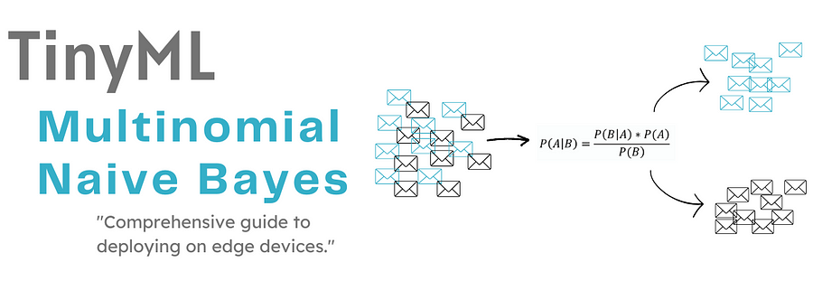
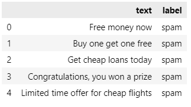
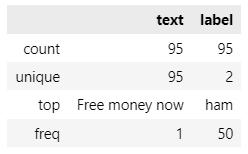
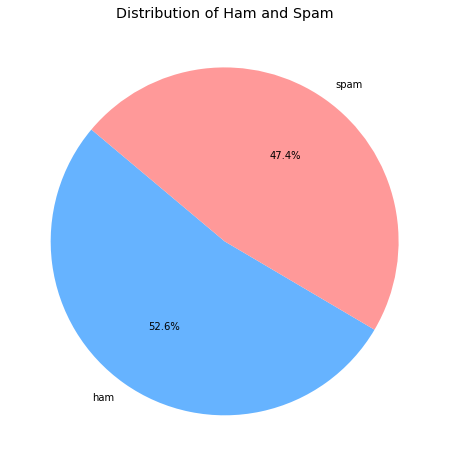
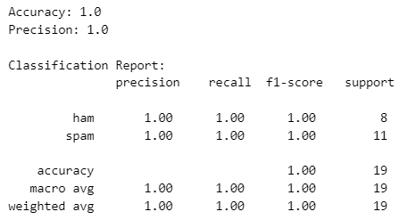
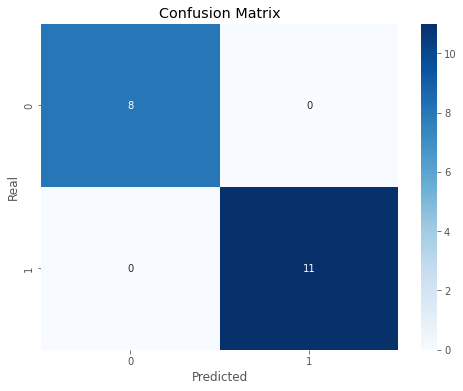
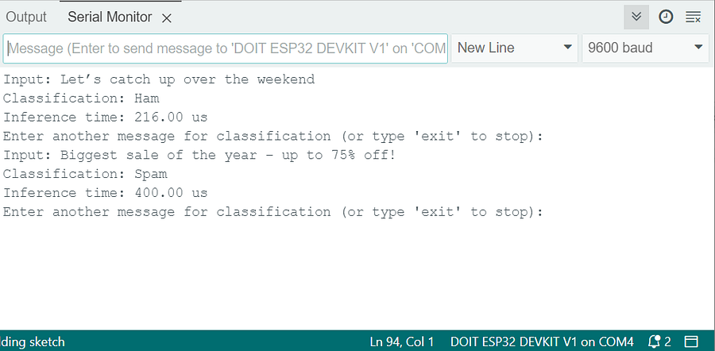

# TinyML - Multinominal Naive Bayes (Text Classifier)

_From mathematical foundations to edge implementation_

**Social media:**

👨🏽‍💻 Github: [thommaskevin/TinyML](https://github.com/thommaskevin/TinyML)

👷🏾 Linkedin: [Thommas Kevin](https://www.linkedin.com/in/thommas-kevin-ab9810166/)

📽 Youtube: [Thommas Kevin](https://www.youtube.com/channel/UC7uazGXaMIE6MNkHg4ll9oA)

:pencil2:CV Lattes CNPq: [Thommas Kevin Sales Flores](http://lattes.cnpq.br/0630479458408181)

👨🏻‍🏫 Research group: [Conecta.ai](https://conect2ai.dca.ufrn.br/)



## SUMMARY

1 — Introduction

2 — Multinomial Naive Bayes

2.1 —Bayes’ Theorem

2.2 — Multinomial Naive Bayes Formula

2.3 — Estimating the Probabilities

2.4 — Putting It All Together

2.5 — Example: Spam vs. Not Spam

3 — Bag-of-Words for Text Feature Extraction

3.1 — Prepare the Text Corpus

3.2 —Tokenization

3.3 — Vocabulary Creation

3.4 — Count Vectorization

4— TinyML Implementation

---

## 1 - Introduction

ext classification is a fundamental task in natural language processing (NLP) that involves categorizing text into predefined labels. One of the most popular algorithms for text classification is the Multinomial Naive Bayes (MNB) classifier. This algorithm is widely used due to its simplicity, efficiency, and effectiveness, especially in applications such as spam detection, sentiment analysis, and topic categorization.

The Multinomial Naive Bayes classifier operates under the assumption that each word in a document is generated independently of the others, given the document's category. This assumption simplifies the computation, making it scalable and fast, even with large datasets. MNB is particularly suitable for text data, where the probability of each word in the vocabulary is conditioned on the class label, thus aligning well with documents represented as word counts or term frequencies.

A key step in building an effective MNB classifier is the Bag-of-Words (BoW) feature extraction technique. This method transforms text documents into a matrix of word occurrences or frequencies, capturing the presence or prevalence of words within each document while disregarding word order. By converting text into numerical data, the BoW model enables the MNB classifier to work with categorical data effectively, making it easier to compute probabilities and classify documents based on their word distributions.

Together, the Multinomial Naive Bayes algorithm and Bag-of-Words feature extraction form a powerful combination for text classification tasks. This approach provides a straightforward yet effective framework for turning raw text into actionable insights, especially useful in fields that demand quick and accurate text categorization.

## 2 - Multinomial Naive Bayes

The Multinomial Naive Bayes classifier is commonly used for text classification tasks where data is in the form of discrete counts (e.g., word frequencies in documents). It is based on Bayes' Theorem and assumes that features (e.g., words in text) are conditionally independent given the class label, a simplification known as the "naive" assumption.

### 2.1 - Bayes' Theorem

The general formula for Bayes' Theorem is:

$$
P(C \mid X) = \frac{P(X \mid C) \cdot P(C)}{P(X)}
$$

Where:

- \(P(C \mid X)\): Posterior probability of class \(C\) given features \(X\)
- \(P(X \mid C)\): Likelihood of features \(X\) given class \(C\)
- \(P(C)\): Prior probability of class \(C\)
- \(P(X)\): Probability of the feature set \(X\) (often ignored in Naive Bayes classification, as it is the same for all classes)

For classification, we want the class \(C\) that maximizes \(P(C \mid X)\). Since \(P(X)\) is constant across all classes, we can ignore it, leading to:

$$
P(C \mid X) \propto P(X \mid C) \cdot P(C)
$$

### 2.2 - Multinomial Naive Bayes Formula

In Multinomial Naive Bayes, we work with feature vectors representing word counts. Let:

- \(X = (x_1, x_2, \dots, x_n)\): Feature vector where \(x_i\) is the count of word \(i\) in the document.
- \(V\): Vocabulary of all possible words (features).
- \(C\): A possible class label.

Then, the probability of a class \(C\) given a document (feature vector) \(X\) is calculated as:

$$
P(C \mid X) \propto P(C) \prod_{i=1}^{|V|} P(x_i \mid C)^{x_i}
$$

Where:

- \(P(C)\): Prior probability of class \(C\), estimated as the proportion of documents in class \(C\).
- \(P(x_i \mid C)\): Probability of word \(i\) occurring in a document from class \(C\).

### 2.3 - Estimating the Probabilities

The probabilities \(P(x_i \mid C)\) for each word \(i\) in the vocabulary are estimated as:

$$
P(x_i \mid C) = \frac{\text{count of word } i \text{ in documents of class } C + \alpha}{\text{total count of words in class } C + \alpha \cdot |V|}
$$

Where:

- \(\text{count of word } i \text{ in documents of class } C\): Total occurrences of word \(i\) across all documents in class \(C\).
- \(\text{total count of words in class } C\): Total number of words across all documents in class \(C\).
- \(\alpha\): Smoothing parameter (often set to 1 for Laplace smoothing) to avoid zero probabilities for words not present in the training set of class \(C\).

### 2.4 - Putting It All Together

For a new document represented by the feature vector \(X = (x_1, x_2, \dots, x_n)\), we calculate the probability of each class \(C\) and predict the class that has the highest probability:

$$
P(C \mid X) \propto P(C) \prod_{i=1}^{|V|} \left( \frac{\text{count of word } i \text{ in class } C + \alpha}{\text{total count of words in class } C + \alpha \cdot |V|} \right)^{x_i}
$$

The predicted class \(\hat{C}\) for the document is the one that maximizes this probability:

$$
\hat{C} = \arg \max_C P(C \mid X)
$$

This approach allows the Multinomial Naive Bayes classifier to efficiently calculate the probability of a document belonging to a class based on word occurrences, making it a popular choice for text-based tasks.

### 2.5 - Example: Spam vs. Not Spam

Let's say we want to classify a document into one of two classes: Spam or Not Spam. Our vocabulary $V$ (the set of all possible words) includes the words: "buy," "cheap," and "click." We have a small dataset with word frequencies for each class.

| Class    | buy | cheap | click |
| -------- | --- | ----- | ----- |
| Spam     | 10  | 5     | 15    |
| Not Spam | 2   | 7     | 3     |

#### 2.5.1 - Step 1: Calculate Priors

First, calculate the prior probabilities for each class. Assume we have 50 total Spam emails and 100 Not Spam emails:

$$
P(\text{Spam}) = \frac{50}{50 + 100} = \frac{1}{3}
$$

$$
P(\text{Not Spam}) = \frac{100}{50 + 100} = \frac{2}{3}
$$

#### 2.5.2 - Step 2: Calculate Likelihoods with Laplace Smoothing

To avoid zero probabilities, we’ll apply Laplace smoothing with $\alpha = 1$.

**Calculate Total Word Counts**

The total word counts in each class are:

- Total words in Spam class: $10 + 5 + 15 = 30$
- Total words in Not Spam class: $2 + 7 + 3 = 12$

  **Calculate Likelihoods $P(x_i \mid C)$**

Using the formula:

$$
P(x_i \mid C) = \frac{\text{count of word } x_i \text{ in class } C + \alpha}{\text{total count of words in class } C + \alpha \cdot |V|}
$$

For the Spam class:

$$
P(\text{buy} \mid \text{Spam}) = \frac{10 + 1}{30 + 1 \cdot 3} = \frac{11}{33} \approx 0.333
$$

$$
P(\text{cheap} \mid \text{Spam}) = \frac{5 + 1}{30 + 1 \cdot 3} = \frac{6}{33} \approx 0.182
$$

$$
P(\text{click} \mid \text{Spam}) = \frac{15 + 1}{30 + 1 \cdot 3} = \frac{16}{33} \approx 0.485
$$

For the Not Spam class:

$$
P(\text{buy} \mid \text{Not Spam}) = \frac{2 + 1}{12 + 1 \cdot 3} = \frac{3}{15} = 0.2
$$

$$
P(\text{cheap} \mid \text{Not Spam}) = \frac{7 + 1}{12 + 1 \cdot 3} = \frac{8}{15} \approx 0.533
$$

$$
P(\text{click} \mid \text{Not Spam}) = \frac{3 + 1}{12 + 1 \cdot 3} = \frac{4}{15} \approx 0.267
$$

#### 2.5.3 - Step 3: Classify a New Document

Suppose we have a new document with the word counts: "buy" appears twice, "cheap" appears once, and "click" appears once. Our feature vector $X = (2, 1, 1)$.Calculate $P(\text{Spam} \mid X)$ using the Multinomial Naive Bayes formula:

$$
P(\text{Spam} \mid X) \propto P(\text{Spam}) \cdot P(\text{buy} \mid \text{Spam})^2 \cdot P(\text{cheap} \mid \text{Spam})^1 \cdot P(\text{click} \mid \text{Spam})^1
$$

Plugging in the values:

$$
P(\text{Spam} \mid X) \propto \frac{1}{3} \cdot (0.333)^2 \cdot (0.182)^1 \cdot (0.485)^1
$$

Calculating each component:

$$
(0.333)^2 = 0.111, \quad (0.182)^1 = 0.182, \quad (0.485)^1 = 0.485
$$

Thus:

$$
P(\text{Spam} \mid X) \propto \frac{1}{3} \cdot 0.111 \cdot 0.182 \cdot 0.485 \approx 0.0033
$$

**Calculate $P(\text{Not Spam} \mid X)$**

Similarly, for the Not Spam class:

$$
P(\text{Not Spam} \mid X) \propto P(\text{Not Spam}) \cdot P(\text{buy} \mid \text{Not Spam})^2 \cdot P(\text{cheap} \mid \text{Not Spam})^1 \cdot P(\text{click} \mid \text{Not Spam})^1
$$

Plugging in the values:

$$
P(\text{Not Spam} \mid X) \propto \frac{2}{3} \cdot (0.2)^2 \cdot (0.533)^1 \cdot (0.267)^1
$$

Calculating each component:

$$
(0.2)^2 = 0.04, \quad (0.533)^1 = 0.533, \quad (0.267)^1 = 0.267
$$

Thus:

$$
P(\text{Not Spam} \mid X) \propto \frac{2}{3} \cdot 0.04 \cdot 0.533 \cdot 0.267 \approx 0.0142
$$

#### 2.5.4 - Step 4: Compare Probabilities and Make Prediction

Now we compare the two probabilities:

$$
P(\text{Spam} \mid X) \approx 0.0033
$$

$$
P(\text{Not Spam} \mid X) \approx 0.0142
$$

Since $P(\text{Not Spam} \mid X) > P(\text{Spam} \mid X)$, we classify the new document as Not Spam.

## 3 - Bag-of-Words for Text Feature Extraction

Text data plays a central role in many machine learning tasks today, including sentiment analysis, document classification, and language translation. However, machine learning algorithms don’t understand text in its raw form, so we need to convert text into a numerical format before using it for modeling. One of the simplest and most effective methods for doing this is the **Bag-of-Words (BoW)** model.

The **Bag-of-Words** (BoW) model is a straightforward technique for converting text data into numerical features. The key idea is to represent each document as a "bag" of its words, while discarding grammar and word order. The BoW model focuses on the **frequency** of words and the **presence** of words in the document.

In the BoW model:

- Each unique word in the document corpus is treated as a feature.
- The document is represented by a vector where each element corresponds to the frequency of a word in the document.

For example, if we have a collection of three documents:

1. Document 1: `"apple orange banana"`
2. Document 2: `"apple apple orange"`
3. Document 3: `"banana orange apple"`

Each word in these documents will be treated as a feature, and the value in the vector will be the count of that word’s occurrences in the document.

### 3.1 - Step 1: Prepare the Text Corpus

Let's start with a small corpus of text documents:

- Document 1: `"apple orange banana"`
- Document 2: `"apple apple orange"`
- Document 3: `"banana orange apple"`

### 3.2 - Step 2: Tokenization

The first step in processing the text is **tokenization**, where the documents are split into individual words or "tokens." This is a crucial step because the BoW model needs a set of words to build its vocabulary.

- Document 1: `['apple', 'orange', 'banana']`
- Document 2: `['apple', 'apple', 'orange']`
- Document 3: `['banana', 'orange', 'apple']`

### 3.3 - Step 3: Vocabulary Creation

After tokenization, we create a **vocabulary** from all unique words across the documents. This vocabulary serves as a reference for all features that will be extracted from each document. In this case, the vocabulary will look like:

- Vocabulary: `['apple', 'orange', 'banana']`

This vocabulary is essentially a list of all distinct words that appear across the corpus. The order of the words in the vocabulary will determine the index of each word in the resulting vectors.

### 3.4 - Step 4: Count Vectorization

Once we have the vocabulary, we create a **document-term matrix (DTM)** by counting how many times each word in the vocabulary appears in each document. This is done for each document in the corpus:

- **Document 1**:

  - "apple" appears 1 time
  - "orange" appears 1 time
  - "banana" appears 1 time

  So, the vector for Document 1 is: `[1, 1, 1]`.

- **Document 2**:

  - "apple" appears 2 times
  - "orange" appears 1 time
  - "banana" appears 0 times

  The vector for Document 2 is: `[2, 1, 0]`.

- **Document 3**:

  - "apple" appears 1 time
  - "orange" appears 1 time
  - "banana" appears 1 time

  The vector for Document 3 is: `[1, 1, 1]`.

The final **document-term matrix (DTM)** looks like this:

| Document   | apple | orange | banana |
| ---------- | ----- | ------ | ------ |
| Document 1 | 1     | 1      | 1      |
| Document 2 | 2     | 1      | 0      |
| Document 3 | 1     | 1      | 1      |

Each document is now represented as a vector based on the frequency of each word from the vocabulary. This matrix can be used in machine learning algorithms for tasks like text classification, clustering, or topic modeling.

## 4 - TinyML Implementation

With this example you can implement the machine learning algorithm in ESP32, Arduino, Arduino Portenta H7 with Vision Shield, Raspberry and other different microcontrollers or IoT devices.

### 4.0 - Install the libraries listed in the requirements.txt file

```python
!pip install -r requirements.txt
```

### 4.1 - Importing libraries

```python
import pandas as pd
import numpy as np
import seaborn as sns
from nltk.corpus import stopwords
from wordcloud import WordCloud
from matplotlib import pyplot as plt
from sklearn.model_selection import train_test_split
from sklearn.metrics import accuracy_score, precision_score, classification_report, confusion_matrix
from sklearn.feature_extraction.text import CountVectorizer, TfidfVectorizer
from sklearn.naive_bayes import MultinomialNB
plt.style.use('ggplot')

```

### 4.2 - Load Dataset

```python
data = {
    'text': [
        # Spam messages
        'Free money now',  # spam
        'Buy one get one free',  # spam
        'Get cheap loans today',  # spam
        'Congratulations, you won a prize',  # spam
        'Limited time offer for cheap flights',  # spam
        'You have a chance to win $1000! Click here to claim',  # spam
        'Earn money from home, no experience required',  # spam
        'Exclusive offer: Get a free iPhone now!',  # spam
        'Hurry! Final days of our big sale',  # spam
        'Claim your free vacation package now',  # spam
        'Get rich quick with this simple trick',  # spam
        'Low interest loans available today',  # spam
        'You have a new credit card offer waiting',  # spam
        'Act now! Special offer for new customers',  # spam
        'Join our millionaire program for free',  # spam
        'Free trial for premium online dating',  # spam
        'Congratulations, you’ve been selected for a free gift!',  # spam
        'Limited time: Buy now and get 90% off!',  # spam
        'Your bank account has been compromised! Click here to verify',  # spam
        'Unlock exclusive access to top-tier jobs today',  # spam
        'Click here to receive your free coupon for discounts',  # spam
        'Get your free credit report today',  # spam
        'We found your perfect match on our dating site!',  # spam
        'Get access to the best online courses for free',  # spam
        'You’re pre-approved for a high-limit credit card!',  # spam
        'Free e-book download: How to make $1000 a day',  # spam
        'Buy now, pay later – easy installment plans',  # spam
        'Make money in your sleep with this proven system',  # spam
        'Get a $500 gift card just for signing up!',  # spam
        'Hurry, last chance to sign up for this exclusive offer!',  # spam
        'Final offer: Free iPad if you act now!',  # spam
        'Huge savings! Shop now for a limited-time deal',  # spam
        'Win a free laptop today by clicking here!',  # spam
        'No experience required! Start your own online business now',  # spam
        'Get your free trial of Netflix now',  # spam
        'Biggest sale of the year – up to 75% off!',  # spam
        'Want to make easy money? Start today with this program!',  # spam
        'Last chance! Free tickets to a major concert event!',  # spam
        'Special offer: Free consultation with our experts',  # spam
        'Get your free fortune reading today!',  # spam
        'Unlock huge savings on luxury watches',  # spam
        'Your account has been suspended, click here to reactivate',  # spam
        'Exclusive invitation: Join now and receive free gifts',  # spam
        'Want a free vacation? Click here for details',  # spam
        'Save up to 90% on the most popular software',  # spam

        # Ham messages
        'Hi, how are you?',  # ham
        'Hello, want to catch up later?',  # ham
        'I miss you, call me!',  # ham
        'Are you free this weekend?',  # ham
        'See you at the meeting',  # ham
        'Let’s grab lunch tomorrow',  # ham
        'What time do we meet for the event?',  # ham
        'I just finished my project, want to hear about it?',  # ham
        'Hope you are doing well!',  # ham
        'Had a great time at the concert last night',  # ham
        'Are you still going to the gym later?',  # ham
        'Do you want to watch a movie tonight?',  # ham
        'Let me know if you need help with that task',  # ham
        'I’ll be back in town on Monday, let’s catch up',  # ham
        'Do you have any recommendations for a good restaurant?',  # ham
        'Can we meet up for coffee tomorrow?',  # ham
        'How’s the family doing?',  # ham
        'Do you need a ride to the airport tomorrow?',  # ham
        'Let’s plan a trip next month',  # ham
        'I’ll send you the files shortly',  # ham
        'Can we reschedule our meeting?',  # ham
        'Looking forward to seeing you at the party',  # ham
        'I’m really excited for the weekend trip',  # ham
        'I need to finish a few tasks, but then I’ll call you',  # ham
        'We should do something fun this Saturday',  # ham
        'Thanks for helping me with the project!',  # ham
        'I saw that movie you recommended – it was great!',  # ham
        'Let me know when you are free to chat',  # ham
        'Did you hear about the new restaurant in town?',  # ham
        'I’m going to try out that new workout class tomorrow',  # ham
        'Do you have any plans for the holidays?',  # ham
        'I’ll pick up some groceries on my way home',  # ham
        'Let’s get together for coffee this afternoon',  # ham
        'Are we still meeting for dinner tonight?',  # ham
        'I need to check my schedule for next week',  # ham
        'How’s the new job going?',  # ham
        'Let me know if you need any help with the presentation',  # ham
        'I’m heading to the park if you want to join',  # ham
        'How did your meeting go? I hope it went well',  # ham
        'I got your message – I’ll get back to you shortly',  # ham
        'Let’s catch up over the weekend',  # ham
        'I’ll bring the book I promised you tomorrow',  # ham
        'Do you want to meet up for a walk later?',  # ham
        'Can you help me with something later today?',  # ham
        'Let’s chat later, I’m a bit busy at the moment',  # ham
        'I need to get a few things done before the weekend',  # ham
        'I’ll call you when I get home',  # ham
        'Looking forward to our catch-up session tomorrow',  # ham
        'Do you need help with your project?',  # ham
        'How’s your day going so far?' # ham
    ],
    'label': [
        # Spam labels
        'spam', 'spam', 'spam', 'spam', 'spam', 'spam', 'spam', 'spam', 'spam', 'spam',
        'spam', 'spam', 'spam', 'spam', 'spam', 'spam', 'spam', 'spam', 'spam', 'spam',
        'spam', 'spam', 'spam', 'spam', 'spam', 'spam', 'spam', 'spam', 'spam', 'spam',
        'spam', 'spam', 'spam', 'spam', 'spam', 'spam', 'spam', 'spam', 'spam', 'spam',
        'spam', 'spam', 'spam', 'spam', 'spam',

        # Ham labels
         'ham', 'ham', 'ham', 'ham', 'ham', 'ham', 'ham', 'ham', 'ham',
        'ham', 'ham', 'ham', 'ham', 'ham', 'ham', 'ham', 'ham', 'ham', 'ham',
        'ham', 'ham', 'ham', 'ham', 'ham', 'ham', 'ham', 'ham', 'ham', 'ham',
        'ham', 'ham', 'ham', 'ham', 'ham', 'ham', 'ham', 'ham', 'ham', 'ham',
        'ham', 'ham', 'ham', 'ham', 'ham', 'ham', 'ham', 'ham', 'ham', 'ham', 'ham'
    ]
}
```

```python
df = pd.DataFrame(data)
df.head()
```



```python
df.describe()
```



```python
label_counts = df['label'].value_counts()
label_counts
```


### 4.3 - Exploratory Data Analysis

```python
plt.figure(figsize=(8, 8))
plt.pie(label_counts, labels=label_counts.index, autopct='%1.1f%%', startangle=140, colors=['#66b3ff', '#ff9999'])
plt.title('Distribution of Ham and Spam')
plt.show()
```



#### 4.3.1 - Spam

```python
wc_spam = WordCloud(width = 500, height = 500, min_font_size = 10, background_color = 'white')
spam_wc = wc_spam.generate(df[df['label'] == 'spam']['text'].str.cat(sep = " "))
plt.figure(figsize = (15,6))
plt.imshow(wc_spam)
plt.show()
```


#### 4.3.1 - Spam

```python
wc_spam = WordCloud(width = 500, height = 500, min_font_size = 10, background_color = 'white')
spam_wc = wc_spam.generate(df[df['label'] == 'ham']['text'].str.cat(sep = " "))
plt.figure(figsize = (15,6))
plt.imshow(wc_spam)
plt.show()
```


### 4.4 - Removing Stop Words words

```python
print(stopwords.words('english'))
```


```python
Count_Vectorizer = CountVectorizer()
Tfidf_Vectorizer = TfidfVectorizer(max_features = 3000)
```


### 4.5 - Extract features using Bag of Words

```python
X = Count_Vectorizer.fit_transform(df['text'])
y = df['label']
```


### 4.6 - Splitting the data

```python
X_train, X_test , y_train, y_test = train_test_split(X,y,test_size = 0.20, random_state = 42)
```

### 4.7 - Define the model


```python
classifier = MultinomialNB()
```


### 4.8 - Training the model


```python
classifier.fit(X_train, y_train)
```


### 4.9 - Model Evaluation


```python
y_pred = classifier.predict(X_test)
```


```python
accuracy = accuracy_score(np.where(y_test == 'spam', 1, 0), np.where(y_pred == 'spam', 1, 0))
precision = precision_score(np.where(y_test == 'spam', 1, 0), np.where(y_pred == 'spam', 1, 0))
```

```python
print(f"Accuracy: {accuracy}")
print(f"Precision: {precision}")

report = classification_report(y_test, y_pred)
print("\nClassification Report:\n", report)
```





```python
conf_matrix = confusion_matrix(y_test, y_pred)

plt.figure(figsize=(8, 6))
sns.heatmap(conf_matrix, annot=True, fmt='d', cmap='Blues')
plt.title('Confusion Matrix')
plt.xlabel('Predicted')
plt.ylabel('Real')
plt.show()

```




### 4.10 - Obtaining the model to be implemented in the microcontroller


```python
# Extract log-probabilities for each class (spam and ham)
log_probs = classifier.feature_log_prob_

# Print log-probabilities for both classes
log_probs_spam = log_probs[0]  # Log-probabilities for the "spam" class
log_probs_ham = log_probs[1]   # Log-probabilities for the "ham" class
vocabulary = Count_Vectorizer.get_feature_names_out()
print('len_vocabulary: ', len(vocabulary)) # you need change this parameter in arduino code.
```


```python
def generate_cpp_code(log_probs_spam, log_probs_ham, vocabulary):

    cpp_code = "const char* vocabulary[] = {"

    for i, word in enumerate(vocabulary):
        cpp_code += f'"{word}"'
        if i <  len(vocabulary)-1:
            cpp_code += ','
    cpp_code += "}; \n\n"

    cpp_code += "const float log_probs_spam[] = {"

    for i, log_prob in enumerate(log_probs_spam):
        cpp_code += f'{log_prob}'
        if i <  len(log_probs_spam)-1:
            cpp_code += ','
    cpp_code += "}; \n\n"

    cpp_code += "const float log_probs_ham[] = {"

    for i, log_prob in enumerate(log_probs_ham):
        cpp_code += f'{log_prob}'
        if i <  len(log_probs_ham)-1:
            cpp_code += ','
    cpp_code += "}; \n\n"

    return cpp_code
```


### 4.11 - Saves the template in a .h file


```python
model = generate_cpp_code(log_probs_spam, log_probs_ham, vocabulary)
```


```python
with open(f'./ArduinoCode/MultinomialNB.h', 'w') as file:
    file.write(model)
```


### 4.12 - Deploy Model


### 4.12.1 - Complete Arduino Sketch


```cpp
#include "MultinomialNB.h"

float start_time = -1;
float end_time = -1;
float width_time = -1;
int len_vocabulary = 280;

// Function to get the index of the word in the vocabulary
int getWordIndex(const char *word) {
  for (int i = 0; i < len_vocabulary; i++) {
    if (strcmp(word, vocabulary[i]) == 0) {
      return i;
    }
  }
  return -1;  // Word not found
}

void setup() {
  // Start serial communication at 9600 baud
  Serial.begin(9600);
  while (!Serial)
    ;  // Wait for connection to the serial port
  Serial.println("Enter a message for classification (type 'exit' to stop):");
}

void loop() {
  static String input = "";             // String to store user input
  static bool processingInput = false;  // Flag to control input processing

  // Check if input is available in the serial buffer
  if (Serial.available() > 0) {
    char c = Serial.read();
    if (c == '\n') {
      // Process input when a new line is detected
      processInput(input);
      input = "";               // Clear input for the next message
      processingInput = false;  // Reset flag
    } else {
      // Add character to input
      input += c;
      processingInput = true;
    }
  }
}

void processInput(String input) {
  // Print the original input message
  Serial.print("Input: ");
  Serial.println(input);

  // Initialize scores
  float spam_score = 0.0;
  float ham_score = 0.0;

  // Create a mutable copy of the input to use with strtok
  char input_copy[100];
  input.toCharArray(input_copy, sizeof(input_copy));

  start_time = micros();

  // Tokenize the input string
  char *token = strtok(input_copy, " ");
  while (token != NULL) {
    int index = getWordIndex(token);
    if (index != -1) {
      // If the word is in the vocabulary, update the scores
      spam_score += abs(log_probs_spam[index]);
      ham_score += abs(log_probs_ham[index]);
    }
    token = strtok(NULL, " ");  // Get the next token
  }
  end_time = micros();

  width_time = end_time - start_time;

  // Classify the input based on the scores
  if (spam_score > ham_score) {
    Serial.print("Classification: ");
    Serial.println("Spam");
    Serial.print("Inference time: ");
    Serial.print(width_time);
    Serial.println(" us ");
  } else {
    Serial.print("Classification: ");
    Serial.println("Ham");
    Serial.print("Inference time: ");
    Serial.print(width_time);
    Serial.println(" us ");
  }

  // Prompt for the next input
  Serial.println("Enter another message for classification (or type 'exit' to stop):");
}
```


### 4.13 - Results


